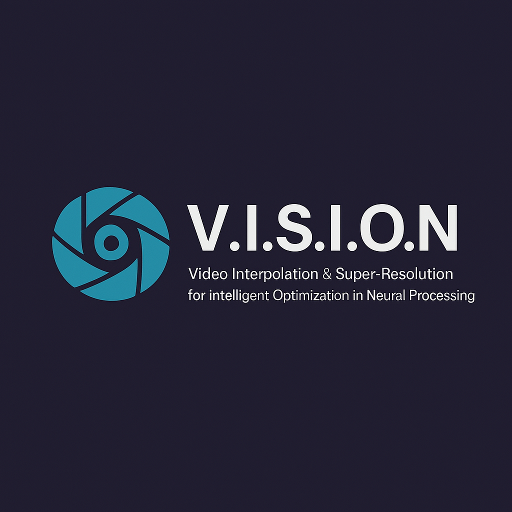

# 🎬 V.I.S.I.O.N

<div align="center">
  
**V**ideo **I**nterpolation & **S**uper-Resolution for **I**ntelligent **O**ptimization in **N**eural Processing

[](https://www.python.org/downloads/)
[](https://pytorch.org/)
[](LICENSE)
</div>

> 🚧 **Work in Progress**: This project is actively being developed and optimized. We're working hard to make it a seamless download-and-run experience!

## 📖 Overview

V.I.S.I.O.N is an advanced video enhancement pipeline that combines two powerful AI technologies:

- 🔍 **Real-ESRGAN**: Enhanced Super-Resolution for upscaling video frames to 4x resolution
- 🎞️ **RIFE**: Real-Time Intermediate Flow Estimation for smooth frame interpolation

This integrated solution transforms low-quality videos into high-resolution, smooth-playing masterpieces by intelligently upscaling frames and generating intermediate frames for fluid motion.

## ✨ Features

- 📈 **4x Super-Resolution**: Upscale video frames using state-of-the-art Real-ESRGAN models
- 🎯 **Frame Interpolation**: Generate smooth intermediate frames with RIFE technology
- 🎨 **Anime Optimization**: Specialized models for anime and cartoon content
- 🔄 **Complete Pipeline**: Automated workflow from input video to enhanced output
- 📊 **Quality Comparison**: Built-in tools to compare original vs enhanced videos
- ⚡ **GPU Acceleration**: CUDA support for faster processing
- 🎵 **Audio Preservation**: Maintains original audio in processed videos

## 🏗️ Project Structure

```
V.I.S.I.O.N/
├── 📁 RESR/                          # Real-ESRGAN Super-Resolution Module
│   ├── 🎬 1_Framerate_Split.py       # Extract frames from input video
│   ├── 🔍 2_main.py                  # Main super-resolution processing
│   ├── 🎞️ 3_Video_Merger.py         # Combine enhanced frames back to video
│   ├── 📺 4_Video_Display.py         # Display and preview results
│   ├── 📊 5_Comparator.py            # Compare original vs enhanced
│   ├── 🔧 main_pipeline.py           # Automated pipeline execution
│   └── 📁 realesrgan/                # Real-ESRGAN core modules
├── 📁 RIFE/                          # Frame Interpolation Module
│   ├── 🎥 inference_video.py         # Video frame interpolation
│   ├── 🖼️ inference_img.py           # Image pair interpolation
│   └── 📁 model/                     # RIFE model architectures
└── 📄 README.md                      # This file
```

## 🚀 Quick Start

### Prerequisites

- Python 3.7+
- CUDA-compatible GPU (recommended)
- FFmpeg installed on your system

### Installation

1. **Clone the repository**

   ```bash
   git clone https://github.com/jishanahmed-shaikh/V.I.S.I.O.N.git
   cd V.I.S.I.O.N
   ```
2. **Install dependencies**

   ```bash
   cd RESR
   pip install -r requirements.txt
   ```
3. **Download Pre-trained Models**

   📥 **Download from Google Drive**: [Model Weights](https://drive.google.com/drive/folders/1FsvxalXW-f3zsypSa8n8r0hq7SNhFO0M?usp=drive_link)

   **For RESR (Super-Resolution)** - Place in `RESR/weights/`:

   - `RealESRGAN_x4plus.pth` (General purpose model)
   - `RealESRGAN_x4plus_anime_6B.pth` (Optimized for anime/cartoon content)

   **For RIFE (Frame Interpolation)** - Place in `RIFE/train_log/`:

   - `flownet.pkl`
   - `IFNet_HDv3.py`
   - `refine.py`
   - `RIFE_HDv3.py`

### Usage

#### 🎯 Super-Resolution Pipeline

1. **Place your input video** in `RESR/1.Input_Video/` (name it `input.mp4`)
2. **Run the complete pipeline**:

   ```bash
   cd RESR
   python main_pipeline.py
   ```

   This will automatically:

   - Extract frames from your video
   - Apply super-resolution enhancement
   - Reconstruct the enhanced video
   - Display results and comparisons
3. **Find your enhanced video** in `RESR/4.Upscaled_Video/`

#### 🎞️ Frame Interpolation

```bash
cd RIFE
python inference_video.py --video path/to/your/video.mp4 --output enhanced_video.mp4 --exp 1
```

**Parameters**:

- `--exp 1`: 2x frame interpolation (doubles frame rate)
- `--exp 2`: 4x frame interpolation
- `--fp16`: Use half-precision for faster processing
- `--UHD`: Enable 4K video support

## 🔧 Configuration

> ⚠️ **Important**: Currently, file paths are hardcoded in the scripts. Please update the paths in each script according to your system directory structure.

**Common paths to update**:

- Input video directory
- Output directories
- Model weights paths

We're actively working on making these paths dynamic and configurable!

## 📊 Performance Tips

- 🖥️ **GPU Memory**: Reduce tile size if you encounter CUDA out of memory errors
- ⚡ **Speed**: Use `--fp16` flag for faster inference on modern GPUs
- 🎯 **Quality**: Use anime-specific models for cartoon/anime content
- 📏 **4K Videos**: Use `--scale 0.5` parameter for 4K video processing

## 🤝 Contributing

We welcome contributions! Whether it's bug fixes, feature additions, or documentation improvements, your help makes V.I.S.I.O.N better.

## 📜 Credits & Acknowledgments

This project builds upon the incredible work of:

- 🔍 **Real-ESRGAN**: [xinntao/Real-ESRGAN](https://github.com/xinntao/Real-ESRGAN)
  - Enhanced Super-Resolution Generative Adversarial Network
- 🎞️ **RIFE**: [hzwer/ECCV2022-RIFE](https://github.com/hzwer/ECCV2022-RIFE)
  - Real-Time Intermediate Flow Estimation for Video Frame Interpolation

## 📧 Support & Contact

Having issues or questions? We're here to help!

**Contact**: kaiser.momin47@gmail.com / shaikhjishan255@gmail.com

## 📄 License

This project is licensed under the MIT License - see the [LICENSE](LICENSE) file for details.

---

<div align="center">

**Made with ❤️ by the V.I.S.I.O.N Team**

*Transforming videos, one frame at a time* ✨

</div>
